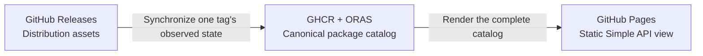
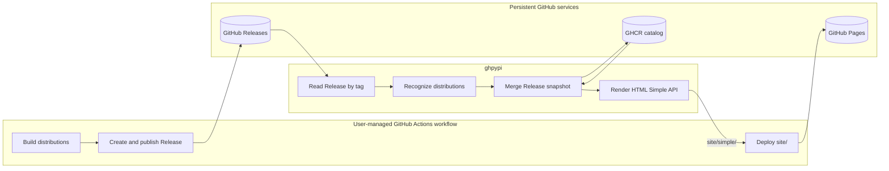
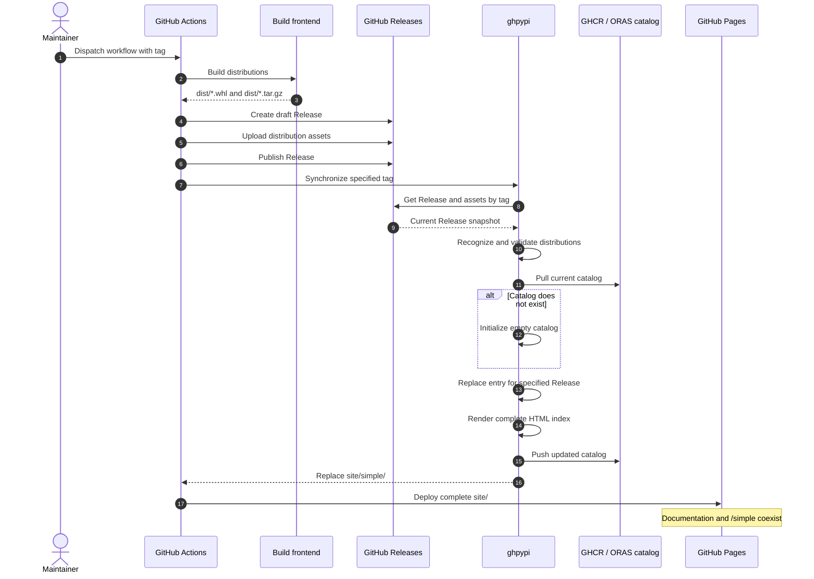

# Contributing

## Architecture

ghpypi is a GitHub Actions-first tool that turns Python distribution assets in GitHub Releases into a PyPI-compatible package registry on GitHub Pages.

This document is the current architecture baseline. It records the design that implementation must preserve; exploratory alternatives remain in the original design discussion rather than in this repository.

### Goals

ghpypi will:

- synchronize one specified GitHub Release into a persistent package catalog;
- recognize valid wheel and source distribution assets by their filenames;
- store the complete catalog as an OCI artifact in GHCR using ORAS;
- generate the HTML serialization of the Python Simple Repository API;
- include SHA-256 URL fragments in distribution links;
- write the generated index to `site/simple/` by default; and
- fit into an existing GitHub Actions release and documentation workflow.

Each package repository owns its own catalog and Simple index. A repository can therefore publish its documentation and package index together:

```text
site/
├── index.html
├── assets/
└── simple/
    ├── index.html
    └── example-package/
        └── index.html
```

### Non-goals

The MVP will not:

- build wheel or source distributions;
- create, edit, publish, or delete GitHub Releases;
- generate release notes;
- require or inspect the Immutable Releases setting;
- monitor a Release after it has been synchronized;
- reconstruct a catalog from every historical Release;
- publish the JSON serialization of the Simple Repository API;
- publish Core Metadata sidecars;
- model `Requires-Python`, yanking, or provenance; or
- manage the user's documentation site outside `site/simple/`.

Building distributions, uploading them, and publishing a Release remain the user workflow's responsibility. Immutable Releases are recommended for reproducibility, but ghpypi behaves identically for mutable and immutable Releases.

### System model

The three GitHub services have distinct responsibilities:



- **GitHub Releases** stores the wheel and source distribution files.
- **GHCR** stores the canonical metadata catalog used to build the index.
- **GitHub Pages** serves a generated view of that catalog.

GitHub Pages is never used as internal storage. The generated HTML can be deleted and reproduced from the GHCR catalog.

### Responsibility boundary



ghpypi owns the complete contents of its configured output directory, `site/simple/` by default. It replaces that directory on generation but does not modify its parent or sibling paths.

Pages deployment is composed from GitHub's official Pages actions. ghpypi produces the index tree; it does not duplicate the Pages deployment protocol or enable Pages repository settings.

### Release workflow

The normal workflow publishes the Release before synchronizing it. This avoids publishing an index that points to draft or otherwise unavailable assets.



The candidate catalog and HTML are built and validated before the canonical catalog is pushed. If catalog publication succeeds but Pages deployment fails, rerunning the workflow can render and deploy the same catalog again.

Catalog updates must be serialized at the workflow level so that concurrent tag workflows cannot overwrite one another's updates.

### Release snapshot semantics

ghpypi receives a repository and tag, resolves the corresponding Release, and records the valid distribution assets visible at that moment. It does not:

- branch on the Release's mutable or immutable status;
- prove that an asset has never changed;
- watch for later asset replacement or deletion; or
- reconcile other Releases that were not requested.

Synchronizing the same tag again replaces that Release's catalog entry with a new observation. Applying an identical observation is a no-op.

This deliberately narrow contract makes Release lifecycle policy an upstream concern. Enabling Immutable Releases is a user choice that makes the recorded snapshot stable without changing ghpypi's behavior.

### Distribution recognition

Release assets are divided into candidates and unrelated assets:

1. Names ending in `.whl` are parsed as wheel filenames.
2. Names ending in `.tar.gz` are parsed as source distribution filenames.
3. Other assets are ignored.
4. A candidate with an invalid Python distribution filename is an error.

Filename parsing and normalization use the `packaging` library rather than custom regular expressions:

- `packaging.utils.parse_wheel_filename()`
- `packaging.utils.parse_sdist_filename()`

All recognized assets in one synchronized Release must belong to one normalized project name and one version. Python prerelease status is derived from the parsed version (for example, `1.2.0rc1`), not from GitHub's `prerelease` flag.

The MVP does not download and inspect archive contents merely to revalidate metadata that the upstream build and release workflow already produced.

### File metadata

Each catalog file record needs enough information to render the MVP index and to support a future JSON serialization:

- filename;
- absolute GitHub Release asset URL;
- byte size; and
- SHA-256 digest.

The GitHub Releases API supplies the asset URL and size. When it supplies a SHA-256 asset digest, ghpypi can use it. If the digest is unavailable, ghpypi must stream the asset and calculate SHA-256 without depending on a local `dist/` directory.

The generated project page uses the digest as a URL fragment:

```html
<a href="https://github.com/owner/repository/releases/download/v1.2.0/example_package-1.2.0-py3-none-any.whl#sha256=...">
  example_package-1.2.0-py3-none-any.whl
</a>
```

### Catalog

The GHCR catalog is the canonical metadata source for the generated index. It is stored as a custom OCI artifact and transported with ORAS.

Conceptually, the catalog contains:

- the source GitHub repository identity;
- one Python project identity;
- Release snapshots keyed by a stable Release identity and tag; and
- normalized distribution file records.

The exact JSON schema, OCI artifact type, layer media type, repository reference, and head-tag convention are detailed-design decisions. They must preserve these architectural properties:

- a catalog snapshot is content-addressable by OCI digest;
- a stable reference identifies the current catalog;
- applying one Release does not require downloading every historical Release;
- reapplying one tag is deterministic and idempotent;
- serializers consume a catalog model rather than GitHub API responses; and
- optional metadata can be added without changing existing field meanings.

### HTML Simple Repository API

The MVP renders the HTML serialization of the [Simple Repository API][simple-api]. It provides:

- valid HTML5 responses;
- one project anchor on the repository root page;
- a normalized project path ending in `/`;
- one anchor per distribution on the project page;
- link text matching the final filename component of the URL; and
- a SHA-256 URL fragment for each distribution.

Root-page project links are relative so that the generated tree works below a GitHub Pages project path:

```html
<a href="./example-package/">example-package</a>
```

Distribution links use absolute GitHub Release asset URLs. Files do not need to share a host with the index.

The HTML renderer is a view over the catalog model. Future JSON support must be implemented as another serialization of that model, not by parsing or extending the generated HTML.

### Failure and retry behavior

The workflow intentionally prefers a temporarily stale index over an index that points to an unpublished Release:

- If Release publication fails, the catalog and Pages remain unchanged.
- If ghpypi fails before pushing the catalog, the catalog remains unchanged.
- If the catalog is pushed but Pages deployment fails, the catalog is current and the Pages deployment can be rerun.
- If a Release is later changed or deleted, ghpypi does not detect it until that tag is explicitly synchronized again.

The synchronization and rendering operations must therefore be safe to rerun.

### MVP boundary

The MVP includes:

- one-tag Release lookup;
- wheel and `.tar.gz` source distribution filename validation;
- asset URL, size, and SHA-256 collection;
- GHCR catalog pull, merge, and push via ORAS;
- complete HTML index rendering;
- full replacement of `site/simple/`; and
- a documented GitHub Actions integration using official Pages actions.

Future work may add:

- full catalog reconstruction from historical Releases;
- JSON Simple Repository API hosting;
- Core Metadata sidecars and `data-core-metadata`;
- `Requires-Python`;
- file yanking;
- provenance;
- additional catalog stores; and
- inspection and rollback tooling for catalog snapshots.

### Detailed-design handoff

The next design phase should define:

1. the catalog JSON schema and its compatibility rules;
2. OCI artifact and layer media types and GHCR reference conventions;
3. the CLI and GitHub Actions interface;
4. Python modules, data classes, and protocols;
5. GitHub, ORAS, filesystem, and renderer boundaries;
6. concurrency and catalog publication mechanics;
7. error taxonomy and exit behavior; and
8. unit, integration, and workflow test strategy.

Those decisions may refine implementation structure, but must not blur the service ownership and responsibility boundaries established here.

### References

- [Python Simple Repository API][simple-api]
- [`packaging.utils` filename parsers][packaging-utils]
- [GitHub Releases REST API][releases-api]
- [ORAS push and custom artifact types][oras-push]
- [GitHub Pages custom workflows][pages-workflows]

[simple-api]: https://packaging.python.org/en/latest/specifications/simple-repository-api/
[packaging-utils]: https://packaging.pypa.io/en/stable/utils.html
[releases-api]: https://docs.github.com/en/rest/releases/releases
[oras-push]: https://oras.land/docs/commands/oras_push/
[pages-workflows]: https://docs.github.com/en/pages/getting-started-with-github-pages/using-custom-workflows-with-github-pages
