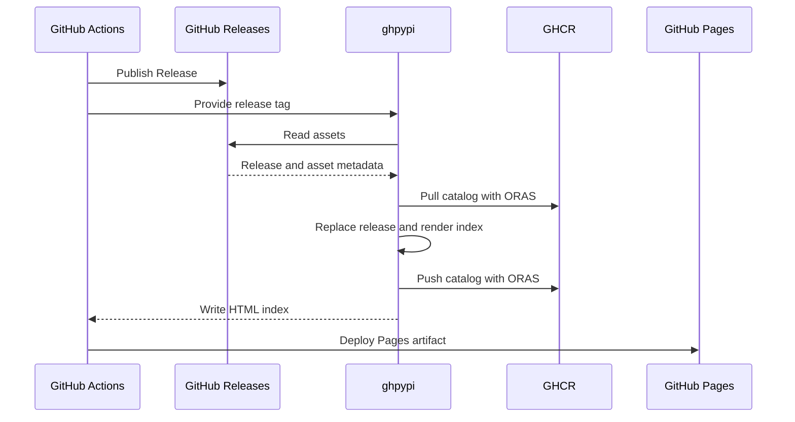

# Contributing

## Architecture

ghpypi adds one GitHub Release to a package catalog and builds a Python Simple index from the full catalog.

### Flow

The GitHub Actions workflow publishes the Release before it runs ghpypi. It deploys `site/` after ghpypi finishes.



### Storage

- **GitHub Releases** stores wheel and source distribution files
- **GHCR** stores the catalog. The catalog is the source of truth for index metadata
- **GitHub Pages** serves the generated HTML index

The default output directory is `site/simple/`:

```text
site/
└── simple/
    ├── index.html
    └── example-package/
        └── index.html
```

ghpypi replaces this directory but does not change its parent or sibling files.

### Distribution files

ghpypi checks Release asset names:

- `.whl` files use [`parse_wheel_filename()`][packaging-utils]
- `.tar.gz` files use [`parse_sdist_filename()`][packaging-utils]
- An invalid wheel or source distribution name is an error
- Other assets are ignored

All distribution files in one Release must have the same normalized project name and version. The version in the filename decides whether a release is a Python prerelease. The GitHub `prerelease` flag does not.

Each file record contains:

- the filename
- the GitHub Release asset URL
- the size in bytes
- the SHA-256 digest

ghpypi uses the digest from the GitHub API when it is available. Otherwise, it downloads the asset as a stream and calculates the digest.

### Catalog rules

- One repository has one catalog
- One catalog contains one Python project
- Syncing a tag replaces the catalog entry for that Release
- Syncing the same state again makes no change
- Rendering and pushing use the same updated catalog
- Catalog updates run one at a time
- An OCI digest identifies an exact catalog snapshot
- A stable OCI tag points to the current catalog

The catalog format is independent of the HTML renderer. A future JSON renderer can use the same catalog.

### HTML index

The index implements the HTML form of the [Simple Repository API][simple-api]:

- every response is valid HTML5
- the root page links to the normalized project path
- the project link is relative
- the project page has one link for each distribution file
- each link text matches the filename in its URL
- each file URL has a SHA-256 fragment

Distribution links use absolute GitHub Release asset URLs. The index and the files do not need to use the same host.

### Boundaries

ghpypi does not:

- build distributions
- create, edit, or publish GitHub Releases
- check whether a Release is mutable or immutable
- watch for later changes to a Release
- deploy GitHub Pages by itself
- change files outside its output directory

[packaging-utils]: https://packaging.pypa.io/en/stable/utils.html
[simple-api]: https://packaging.python.org/en/latest/specifications/simple-repository-api/
