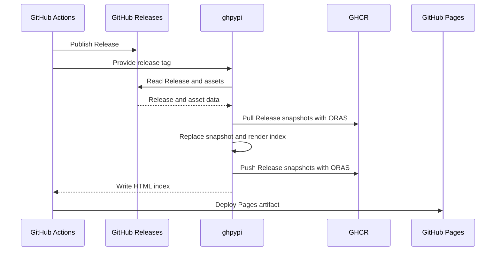

# Contributing

## Architecture

ghpypi stores a snapshot of one GitHub Release in GHCR and builds a Python Simple index from all stored Release snapshots.

### Flow



### Storage

- **GitHub Releases** stores wheel and source distribution files
- **GHCR** stores the Release snapshots that are the source of truth for the index
- **GitHub Pages** serves the generated HTML index

By default, ghpypi replaces only `site/simple/`:

```text
site/
└── simple/
    ├── index.html
    └── example-package/
        └── index.html
```

### Distribution files

ghpypi parses `.whl` and `.tar.gz` asset names with [`parse_wheel_filename()` and `parse_sdist_filename()`][packaging-utils]. It ignores other assets and rejects invalid distribution filenames.

All distribution files in one Release must have the same normalized project name and version.

ghpypi uses each asset's filename, download URL, size, and digest to build the index.

### Release snapshots

- Each tag identifies one Release snapshot
- A snapshot keeps the raw Release and asset data returned by the GitHub API
- Data calculated by ghpypi is stored separately from the raw GitHub data
- Processing a tag replaces its snapshot with the current API data
- Snapshot updates run one at a time

### HTML index

The index follows the required rules of the [Simple Repository API][simple-api]. It adds a SHA-256 URL fragment when GitHub provides the digest.

Project links are relative. Distribution links are absolute GitHub Release asset URLs.

### Boundaries

ghpypi does not:

- build distributions or manage GitHub Releases
- check whether a Release is mutable or immutable, or watch for later changes
- deploy GitHub Pages by itself
- change files outside its output directory

[packaging-utils]: https://packaging.pypa.io/en/stable/utils.html
[simple-api]: https://packaging.python.org/en/latest/specifications/simple-repository-api/
