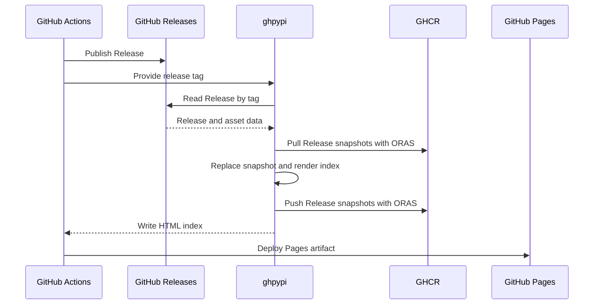
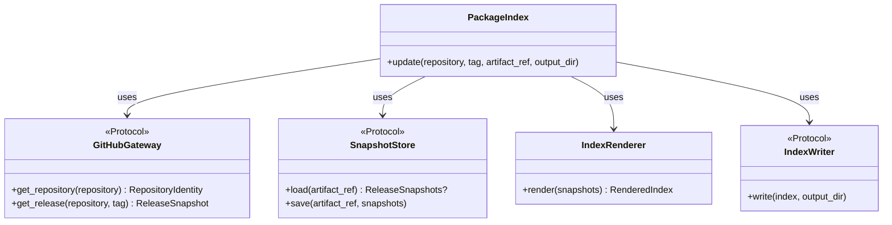
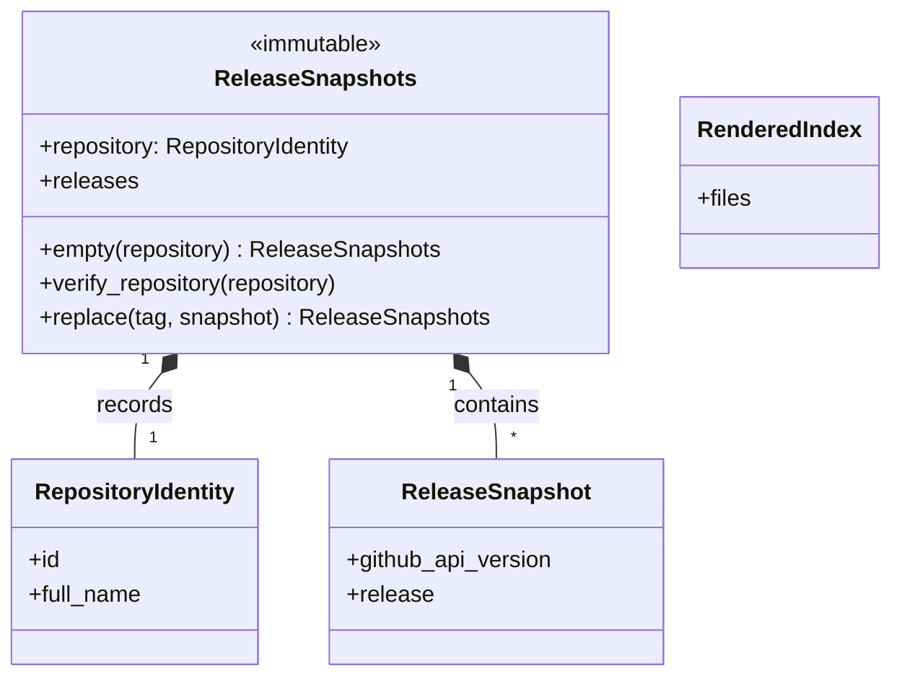

# Contributing

## Development

Install the project and its development dependencies from the lockfile:

```shell
uv sync
```

Run the static checks:

```shell
uv run -- ruff check
uv run -- ruff format --check
uv run -- ty check
```

Apply automatic fixes and formatting:

```shell
uv run -- ruff check --fix
uv run -- ruff format
```

## Architecture

ghpypi stores a snapshot of one GitHub Release in GHCR and builds a Python Simple index from all stored Release snapshots.

### Flow



ghpypi renders and validates the complete index before it changes GHCR or the output directory. It then stores the updated snapshots in GHCR and writes the rendered index. If writing the index fails, processing the same tag again repairs it.

### Storage

- **GitHub Releases** stores wheel and source distribution files
- **GHCR** stores the Release snapshots that are the source of truth for the index
- **GitHub Pages** serves the generated HTML index

Each repository has one OCI artifact containing all of its Release snapshots. Its default reference is `ghcr.io/<owner>/ghpypi/<repository>:latest`.

By default, ghpypi replaces only `site/simple/`:

```text
site/
└── simple/
    ├── index.html
    └── example-package/
        └── index.html
```

### Distribution files

ghpypi parses `.whl` and `.tar.gz` asset names with [`parse_wheel_filename()` and `parse_sdist_filename()`][packaging-utils]. It ignores other assets and rejects invalid distribution filenames.

All distribution files in one Release must have the same normalized project name and version.

ghpypi uses each asset's filename, download URL, size, and digest to build the index.

### Release snapshots

- Each tag identifies one Release snapshot
- A snapshot keeps the raw response from GitHub's Release API, including its assets
- The snapshot collection records the repository ID and full name
- Processing a tag replaces its snapshot with the current API data
- The Simple index is rebuilt from all snapshots on every run
- Snapshot updates run one at a time

`SnapshotStore.load()` returns `None` when the artifact does not exist, and ghpypi starts with an empty snapshot collection for the current repository identity. Existing collections must match that identity. A repository mismatch or any other artifact or snapshot error stops the update.

### HTML index

The index follows the required rules of the [Simple Repository API][simple-api]. It adds a SHA-256 URL fragment when GitHub provides the digest.

Project links are relative. Distribution links are absolute GitHub Release asset URLs.

### Boundaries

ghpypi does not:

- build distributions or manage GitHub Releases
- check whether a Release is mutable or immutable, or watch for later changes
- deploy GitHub Pages by itself
- change files outside its output directory

### Components

#### Behavior



#### Data models



`PackageIndex` controls the update flow. `ReleaseSnapshots` owns the stored state and its replacement rules. `IndexRenderer` builds a validated `RenderedIndex` before the snapshot store and index writer change external state.

[packaging-utils]: https://packaging.pypa.io/en/stable/utils.html
[simple-api]: https://packaging.python.org/en/latest/specifications/simple-repository-api/
