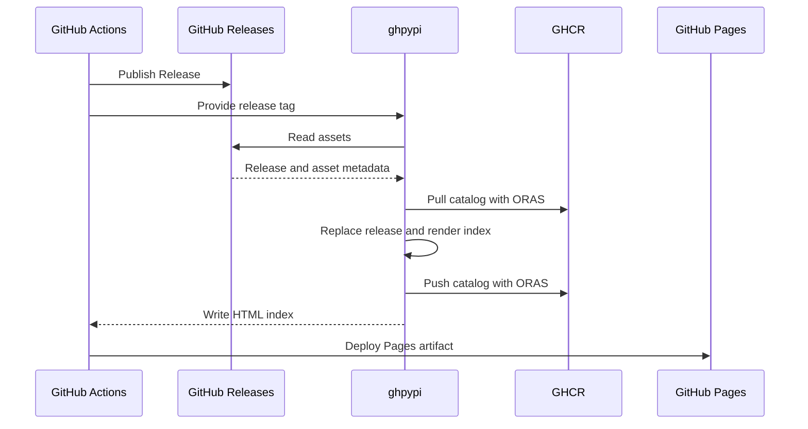

# Contributing

## Architecture

ghpypi adds one GitHub Release to a package catalog and builds a Python Simple index from the full catalog.

### Flow



### Storage

- **GitHub Releases** stores wheel and source distribution files
- **GHCR** stores the catalog. The catalog is the source of truth for index metadata
- **GitHub Pages** serves the generated HTML index

By default, ghpypi replaces only `site/simple/`:

```text
site/
└── simple/
    ├── index.html
    └── example-package/
        └── index.html
```

### Distribution files

ghpypi parses `.whl` and `.tar.gz` asset names with [`parse_wheel_filename()` and `parse_sdist_filename()`][packaging-utils]. It ignores other assets and rejects invalid distribution filenames.

All distribution files in one Release must have the same normalized project name and version.

Each catalog file record stores the filename, GitHub Release asset URL, size, and SHA-256 digest. If the GitHub API does not provide the digest, ghpypi downloads the asset as a stream and calculates it.

### Catalog

- Each repository has one catalog for one Python project
- Processing a Release replaces its catalog entry
- Processing the same state again makes no change
- Catalog updates run one at a time

### HTML index

The index follows the required rules of the [Simple Repository API][simple-api] and adds SHA-256 URL fragments.

Project links are relative. Distribution links are absolute GitHub Release asset URLs.

### Boundaries

ghpypi does not:

- build distributions or manage GitHub Releases
- check whether a Release is mutable or immutable, or watch for later changes
- deploy GitHub Pages by itself
- change files outside its output directory

[packaging-utils]: https://packaging.pypa.io/en/stable/utils.html
[simple-api]: https://packaging.python.org/en/latest/specifications/simple-repository-api/
